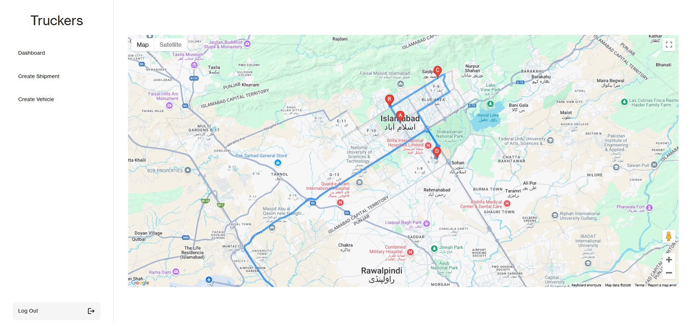
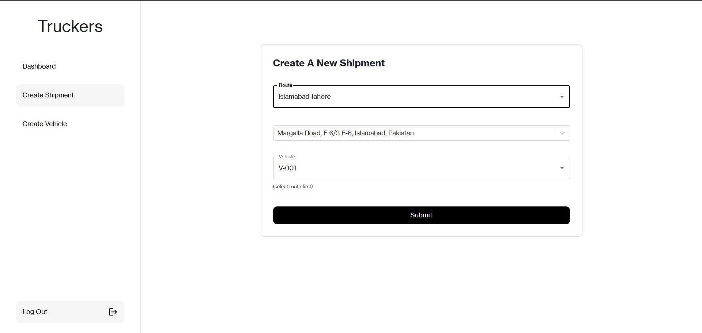
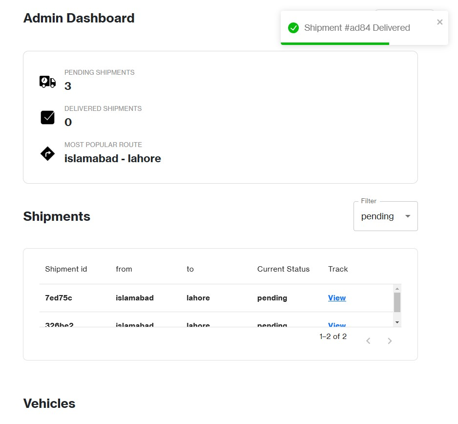
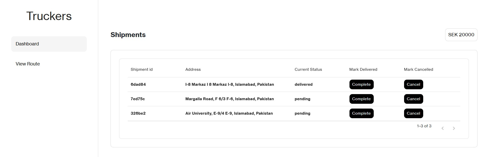

# 🚚 Truckers - Shipment Management & Tracking System  

**Truckers** is a shipment management and tracking system for courier services, providing real-time updates on order statuses. The application also assists drivers by optimizing routes for vehicles carrying multiple shipments using **Google Maps API**.  

## 🚀 Features  

### 🚛 For Drivers  
- View assigned shipments  
- Get optimized routes for multiple deliveries  
- Update shipment statuses (Picked, In-Transit, Delivered)  

### 📊 For Admins  
- Manage shipments and orders  
- Assign shipments to drivers  
- Monitor delivery progress  

## 🛠️ Technology Stack  

- **Frontend:** React.js, Redux  
- **Backend:** Node.js, Express.js  
- **Database:** MongoDB, Mongoose  
- **Maps & Routing:** Google Maps API  
- **Authentication:** JSON Web Token (JWT)
  
# 🖼️ Screenshots

## Route View

## Create Shipment Page (For Admins)

## Admin recieving notification in real-time

## Driver Dashboard

